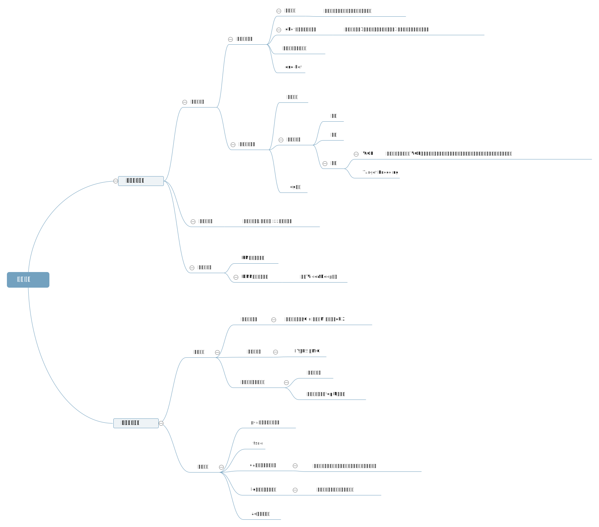
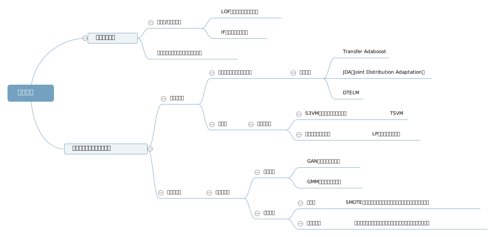

**该notebook以titanic数据为例，梳理了一些ml建模常用的操作，包括如下一些内容：**

1. [理解数据>>>](https://nbviewer.jupyter.org/github/zhulei227/ML_Skills/blob/master/%E6%9C%BA%E5%99%A8%E5%AD%A6%E4%B9%A0%E5%BB%BA%E6%A8%A1%E6%B5%81%E7%A8%8B%E6%A2%B3%E7%90%86/1.%E7%90%86%E8%A7%A3%E6%95%B0%E6%8D%AE.ipynb)

   包括：简单数据理解以及可视化分析(pandas,seaborn)

2. [数据清洗>>>](https://nbviewer.jupyter.org/github/zhulei227/ML_Skills/tree/master/%E6%9C%BA%E5%99%A8%E5%AD%A6%E4%B9%A0%E5%BB%BA%E6%A8%A1%E6%B5%81%E7%A8%8B%E6%A2%B3%E7%90%86/2.%E6%95%B0%E6%8D%AE%E6%B8%85%E6%B4%97.ipynb)

   包括：数据删除（饱和度、稳定性、相关性、低方差）、空值填充（注意数据泄露）、数据盖帽（cap_floor）等

3. [特征工程简介及模型选择>>>](https://nbviewer.jupyter.org/github/zhulei227/ML_Skills/tree/master/%E6%9C%BA%E5%99%A8%E5%AD%A6%E4%B9%A0%E5%BB%BA%E6%A8%A1%E6%B5%81%E7%A8%8B%E6%A2%B3%E7%90%86/3.%E7%89%B9%E5%BE%81%E5%B7%A5%E7%A8%8B%E5%8F%8A%E6%A8%A1%E5%9E%8B%E9%80%89%E6%8B%A9.ipynb)

   1.）特征工程：categorical 变量的处理、数据归一化操作(z-score,min-max,normalize,log,boxcox,cdf,pdf变换等)、数据分箱、WOE特征；

   2.）模型选择：方差-偏差，过拟合-欠拟合分析等

4. 模型优化

   模型优化可以从两个方面来考虑，一个是数据端，另一个是模型端，在数据端又可以从两个方向来考虑，纵向对特征作特征工程，横向对数据作增强，模型端也可以从两个方向来考虑，对单个模型作超参优化，对多个模型作集成学习，下面展开介绍：

   4.1 [特征优化>>>](https://nbviewer.jupyter.org/github/zhulei227/ML_Skills/tree/master/%E6%9C%BA%E5%99%A8%E5%AD%A6%E4%B9%A0%E5%BB%BA%E6%A8%A1%E6%B5%81%E7%A8%8B%E6%A2%B3%E7%90%86/4.%E7%89%B9%E5%BE%81%E5%A2%9E%E5%BC%BA.ipynb)

   > 4.1.1 增加有用的特征：
   >
   > 根据背景知识造特征、聚类算法构建新特征、构建多项式特征、自动构建组合特征(gbdt+lr)；  
   
   > 4.1.2 去掉无用的特征：  
   
   > > 1.) 特征选择：基于统计方法的方差、相关性、gini、mi、chi2选择等，基于模型的迭代消除法等；  
   > >
   > > 2.) 特征变换：pca、lda、lle(局部线性嵌入)、ae（自编码）、vae（变分自编码）等  
   
   
   
   4.2 [数据优化>>>](https://nbviewer.jupyter.org/github/zhulei227/ML_Skills/tree/master/%E6%9C%BA%E5%99%A8%E5%AD%A6%E4%B9%A0%E5%BB%BA%E6%A8%A1%E6%B5%81%E7%A8%8B%E6%A2%B3%E7%90%86/5.%E6%95%B0%E6%8D%AE%E5%A2%9E%E5%BC%BA.ipynb)
   
   数据优化如下图所示，同样包括两个主要方向，一个是去掉无用的样本，或者弱化无用的样本，可以采用异常检测算法或者代价敏感学习，另一个方向是增加有用样本，又分为两个方向，一个是看有没有类似的样本，如果有可以考虑迁移学习或者半监督学习，如果没有类似样本，可以考虑通过GAN，GMM等方式自动生成伪数据，或者通过采样，自定义规则等造伪数据（当前仅对部分内容做实现，后续会对异常检测、代价敏感学习、数据增强等分专题介绍）
   
   
   
    4.3 [模型优化>>>](https://nbviewer.jupyter.org/github/zhulei227/ML_Skills/tree/master/%E6%9C%BA%E5%99%A8%E5%AD%A6%E4%B9%A0%E5%BB%BA%E6%A8%A1%E6%B5%81%E7%A8%8B%E6%A2%B3%E7%90%86/6.%E6%A8%A1%E5%9E%8B%E4%BC%98%E5%8C%96.ipynb)
   
   > 4.3.1 超参优化：随机搜索、网格搜索、贝叶斯优化
   >
   > 4.3.2 集成学习：bagging、boosting、stacking

